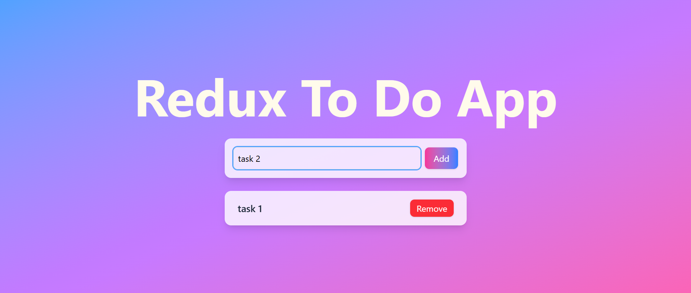

# Redux Todo App

A modern, responsive Todo application built with React, Redux Toolkit, and Tailwind CSS. This app demonstrates state management using Redux Toolkit with a clean, gradient-based UI design.

## 📸 Screenshot



*Beautiful gradient UI with glass morphism design*

## ✨ Features

- **Add Todos**: Create new todo items with a clean input form
- **Remove Todos**: Delete completed or unwanted todos with a single click
- **Persistent State**: Todos are managed through Redux Toolkit for reliable state management
- **Modern UI**: Beautiful gradient design with smooth hover animations
- **Responsive Design**: Works seamlessly on desktop and mobile devices
- **Real-time Updates**: Instant UI updates when adding or removing todos

## 🛠️ Tech Stack

- **Frontend Framework**: React 19.1.0
- **State Management**: Redux Toolkit (@reduxjs/toolkit)
- **Styling**: Tailwind CSS 4.1.11
- **Build Tool**: Vite 7.0.0
- **Deployment**: GitHub Pages

## 🚀 Live Demo

Check out the live application: [Redux Todo App](https://knishkarora.github.io/redux-todo)

## 📦 Installation

1. **Clone the repository**
   ```bash
   git clone https://github.com/knishkarora/redux-todo.git
   cd redux-todo
   ```

2. **Install dependencies**
   ```bash
   npm install
   ```

3. **Start the development server**
   ```bash
   npm run dev
   ```

4. **Open your browser**
   Navigate to `http://localhost:5173` to view the application

## 🏗️ Project Structure

```
src/
├── app/
│   └── store.js          # Redux store configuration
├── components/
│   ├── AddTodo.jsx       # Todo input component
│   └── Todo.jsx          # Todo list display component
├── features/
│   └── todo/
│       └── todoSlice.js  # Redux slice for todo state management
├── App.jsx               # Main application component
└── main.jsx             # Application entry point
```

## 🎯 Usage

### Adding a Todo
1. Type your todo text in the input field
2. Click the "Add" button or press Enter
3. Your todo will appear in the list below

### Removing a Todo
1. Click the "Remove" button next to any todo item
2. The todo will be instantly removed from the list

## 🔧 Available Scripts

- `npm run dev` - Start development server
- `npm run build` - Build for production
- `npm run preview` - Preview production build
- `npm run lint` - Run ESLint
- `npm run deploy` - Deploy to GitHub Pages

## 🎨 UI Features

- **Gradient Background**: Beautiful blue-to-purple-to-pink gradient
- **Glass Morphism**: Semi-transparent white cards with backdrop blur
- **Hover Effects**: Smooth transitions and color changes on interaction
- **Responsive Layout**: Adapts to different screen sizes
- **Modern Typography**: Clean, readable font styling

## 📱 Responsive Design

The application is fully responsive and works great on:
- Desktop computers
- Tablets
- Mobile phones

## 🚀 Deployment

This app is automatically deployed to GitHub Pages. The deployment process:
1. Builds the production version
2. Deploys to the `gh-pages` branch
3. Makes the app available at the configured GitHub Pages URL

## 🤝 Contributing

1. Fork the repository
2. Create a feature branch (`git checkout -b feature/amazing-feature`)
3. Commit your changes (`git commit -m 'Add some amazing feature'`)
4. Push to the branch (`git push origin feature/amazing-feature`)
5. Open a Pull Request

## 📄 License

This project is open source and available under the [MIT License](LICENSE).

## 👨‍💻 Author

**Knishk Arora**
- GitHub: [@knishkarora](https://github.com/knishkarora)

---

⭐ If you found this project helpful, please give it a star!
